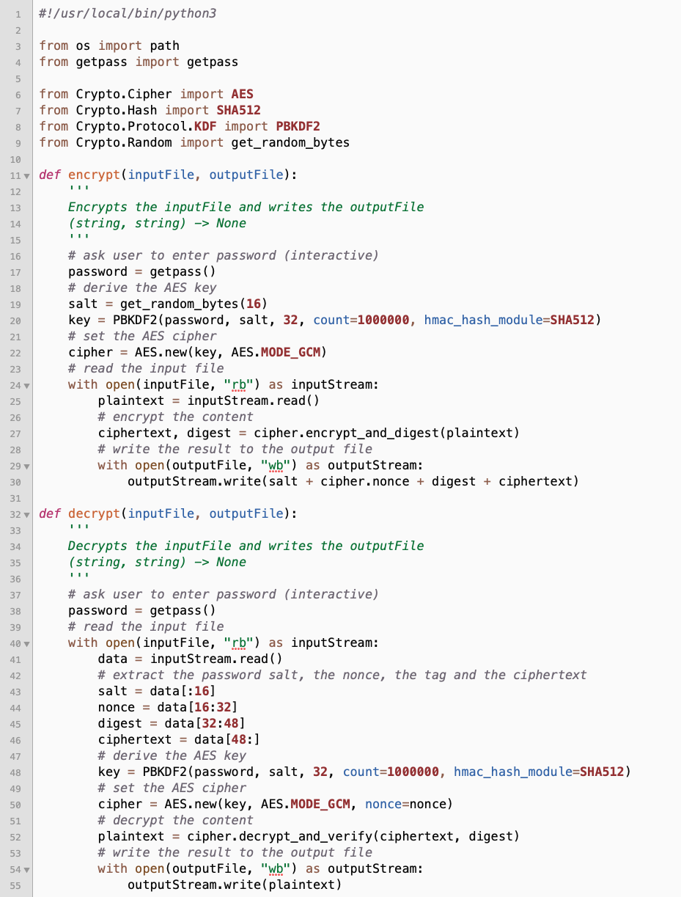
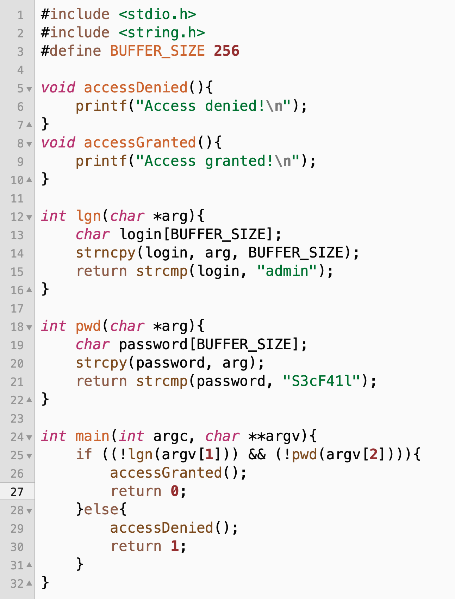
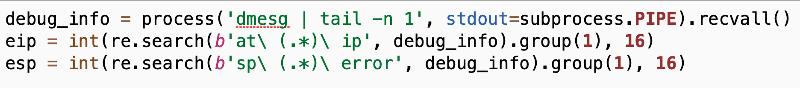

# CSCD27 Final

During the exam:

- you are allowed to use any course material posted on the D27 course website, Seclab and Piazza
- you are allowed to look at your own challenge solutions and your own notes
- you are allowed to ask private questions to the instructor on Zoom but please join the Zoom discussion room if and only if you have a question.

However:

- you are not allowed to search anything online during the exam (except D27 course website and SecLab)
- you are not allowed to discuss the content of the midterm with anyone either physically or anywhere online up until 4H after the beginning of the midterm (to accommodate accessibility students)
- you are not allowed to ask questions on Piazza until 4H after the beginning of the midterm

## Introduction

## Part 1

In this article published on December 6, 2020, it says that the Kazakhstan Government has been able to "intercept HTTPS traffic" using a man-in-the-middle attack. 

[https://www.zdnet.com/article/kazakhstan-government-is-intercepting-https-traffic-in-its-capital/](https://www.zdnet.com/article/kazakhstan-government-is-intercepting-https-traffic-in-its-capital/)

After reading the article but without paraphrasing it,  explain how such an attack has been possible. You might want to explain the details of the man-in-the-middle attack by using an example involving: 

- Borat who lives in Kazakthan and browses HTTPS websites hosted outside Kazakthan 
- and the Kazakhstan Government that controls all traffic that goes in and out of Kazakthan

## Part 2

On December 10 2020, Microsoft unveiled a malware campaign called Adzorek. 

[https://www.microsoft.com/security/blog/2020/12/10/widespread-malware-campaign-seeks-to-silently-inject-ads-into-search-results-affects-multiple-browsers/](https://www.microsoft.com/security/blog/2020/12/10/widespread-malware-campaign-seeks-to-silently-inject-ads-into-search-results-affects-multiple-browsers/)

You are not expecting to understand everything from this article. However, you should have a sufficient level of expertise to be able to extract the most important information and answer the questions below. 

In your answers,  do not paraphrase the article but come up with your own expertise and your own analyze. We strongly recommend you to write about things you fully understand. 

1. How does the malware spread (a.k.a the infection vector)? In your answer you want to be specific whether the malware relies on social engineering or exploits a vulnerability in a program. 
2. How does the malware becomes persistent? Said differently, how does the malware stays on your system even after rebooting it?  
3. What does the malware do (a.k.a the payload)? In your answer you want to be specific about how the malware compromise the security of the system. 
4. What technique does the malware uses to become undetectable and/or defeats antivirus? 

## Part 3

The RCMP (the Canadian equivalent of the FBI) is suspecting Mallory to be behind the large scale attack that targeted thousand of Bank-of-Fail ATMs couple of weeks ago. They have raided Mallory's home and seized her laptop hoping to find some evidences to convict her. 

Unfortunately, they is nothing suspicious on her computer except thousands of binary files and a python script. The police has good reasons to believe that all of these binary files are actually encrypted and Mallory uses the python script to encrypt and decrypt these files. 

The police has hired you as a consultant to help them crack these files. They show you the python script and ask your opinion on several questions. For each questions, clearly answer whether you believe the attack has a good chance to succeed or not:

- if you believe that the attack is possible, 1) explain where the vulnerability is in the code (you should precisely identify 1-3 line numbers in the code only) and 2) how to exploit that vulnerability to perform the attack. Note that you are not asked to write any code or command but you should detail every step of the attack carefully. 
- if you believe that the attack is not possible 1) justify by saying what makes the code strong exactly (you should precisely identify 1-3 line numbers in the code only) and 2) how this prevents from performing the attack. 

In this exercise, you are allowed to browse the following PyCryptodome documentation:

- AES in GCM mode: [https://pycryptodome.readthedocs.io/en/latest/src/cipher/modern.html#gcm-mode](https://pycryptodome.readthedocs.io/en/latest/src/cipher/modern.html#gcm-mode)
- SHA256: [https://pycryptodome.readthedocs.io/en/latest/src/hash/sha256.html?highlight=sha256#Crypto.Hash.SHA256.SHA256Hash](https://pycryptodome.readthedocs.io/en/latest/src/hash/sha256.html?highlight=sha256#Crypto.Hash.SHA256.SHA256Hash)
- PBKDF2: [https://pycryptodome.readthedocs.io/en/latest/src/protocol/kdf.html?highlight=PBKDF2#pbkdf2](https://pycryptodome.readthedocs.io/en/latest/src/protocol/kdf.html?highlight=PBKDF2#pbkdf2)

Here is the code:

1. Given an encrypted file, the police believes that they can brute-force the AES key for that file? 
2. Given an encrypted file and assuming Mallory has a weak password for that file, the police believes that they can brute-force Mallory's password for that file using a dictionary attack with a tool such as John the Reaper or Hashcat?
3. Given an encrypted file and assuming Mallory has a weak password for that file, the police believes that they can brute-force Mallory's password for that file using a rainbow table attack with a tool such as RainbowCrack? 
4. Assuming that Mallory has encrypted two exactly the same plaintext files with the same password, the police believes that they can identify those files since the two corresponding ciphertext files will be the same?
5. Assuming that Mallory has encrypted two different plaintext files with the same password, the police believes that a key-reused attack is possible?

# Part 4

Mallory is suspecting this program to contain an interesting bug.

1. Without any security consideration yet, can you explain what kind of bug it is and how to trigger it? You might want to be very specific about where the bug occurs in the code. 

2. Mallory is able to get some information about the eip and esp when the bug occurs. Based on the eip and esp, Mallory believes that she can write an exploit to bypass the login and password verification. Write the exploit to execute the function accessGranted without having the password. FYI, we are not going to run the code but we are going to look at the logic. 

3. For this exploit to work, the program must be compiled with the following stack protection(s) necessarily disabled (select only the necessary ones):

    - -fno-stack-protector
    - -z execstack

4. Based on the eip and esp information obtained earlier, Mallory believes that she can force the program to execute an arbitrary piece of assembly code. Write the exploit to execute the piece of assembly code contained in the variable named "attack" (what this piece of code does is not relevant here). FYI, we are not going to run the code but we are going to look at the logic.

5. The variable "attack" that contains the arbitrary piece of code that is executed when the attack succeeds is called a 

6. For this exploit to work, the program must be compiled with the following stack protection(s) necessarily disabled (select only the necessary ones):

    - -fno-stack-protector
    - -z execstack
    
7. Stack canaries protects the stack by:

    - preventing any buffer stored on the stack to overflow
    - detecting that an overflow has overwritten the returned address of the stack frame
    - detecting the injection of malicious code
    - preventing malicious code from being written to the stack
    - preventing the execution of code stored in memory addresses that were previously identified as containing data
    - preventing memory addresses to be predictable
    
8. Executable-space protection protects the stack by:

    - preventing buffer stored on the stack to overflow
    - detecting that an overflow has overwritten the returned address of the stack frame
    - detecting the injection of malicious code
    - preventing malicious code from being written on the stack
    - preventing the execution of code stored in memory addresses that were previously identified as containing data
    - preventing memory addresses to be predictable
    
9. ASLR (Address Space Layout Randomization) prevents the attacker from guessing memory addresses reliably by

    - obfuscating all memory addresses when compiling the source code
    - randomizing the layout of functions and library calls when compiling the source code
    - shifting the entire address space by a random offset when executing the program
    - randomizing the layout of the stack when executing the program
    
10. Mallory has found a compiled version of that program in a directory own by root that she is allowed to execute as www. This program has the setuid flag enabled (”set user ID upon execution”) and is owned by the user johnfail, the system administrator maintaining the server. If Mallory is able to exploit that buffer overflow vulnerability, she might be able to performed unauthorized actions executed as:

    - mallory
    - www
    - johnfail
    - root
    
# Part 5 

Mallory is now attacking the web application that the SecFail University students use to register for classes. The web application uses HTTPS however Mallory has identified several potential vulnerabilities.

1. Match each vulnerability with its name.  

    - A vulnerability that could allow her to eavesdrop or inject content send back and forth with the website since the main HTTPS webpage loads images, scripts and stylesheets in HTTP
    - A vulnerability that could allow her to inject arbitrary client-side javascript code into the webpage
    - A vulnerability that could allow her to manipulate inputs to change the normal behaviour of backend database requests
    - A vulnerability that could allow her to force end-users to execute unwanted actions on a web application in which they are currently authenticated
    
2. Which vulnerability does not require end-users to perform some action to activate the exploit:

    - Incomplete mediation
    - SQL injection
    - Cross-site request forgery (CSRF)
    - Cross-site scripting (XSS)
    
3. Exploiting an XSS vulnerability might allow the attacker to:

    - steal user’s session/credentials
    - change the layout and/or content of the vulnerable webpage
    - force end-users to performed unsolicited actions
    - force end-users to mine digital currency without their consent
    - install a reverse shell on the server
    - crash the web server

4. Web applications that uses NoSQL databases are immune to query execution attacks similar to sql injection. 

5. Let us assume that a web application from the domain A allows cross-domain requests from another webpage from domain B. When executing a cross-domain AJAX request, the browser attaches to that request:

    - the cookie from domain A automatically
    - the cookie from domain A if the Javascript code for that Ajax requests explicit mentions withCredentials:true
    - the cookie from domain B automatically
    - the cookie from domain B if the Javascript code for that Ajax requests explicit mentions withCredentials:true

6. In its simplest form, an CSRF attack exploits the limitation of the Same-Origin Policy that:

    - allows cross-origin requests and responses
    - allows cross-origin requests but blocks the responses
    - blocks cross-origin requests but allows the responses
    - blocks all cross-origin requests

## Bonus 

There are no bad answers to the questions below. You will get points if the instructors believes you genuinely made some efforts to provide an answer. Keep in mind that quantity does not beat quality.

1. Would you recommend this course to other students? Yes/No because ... 
2. Share something with the course staff