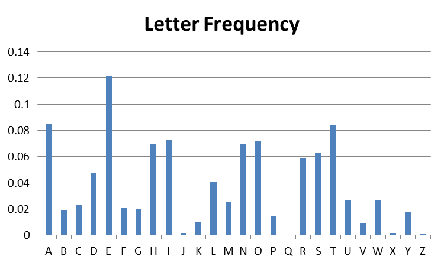
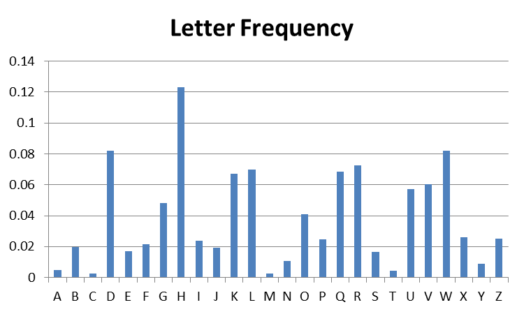
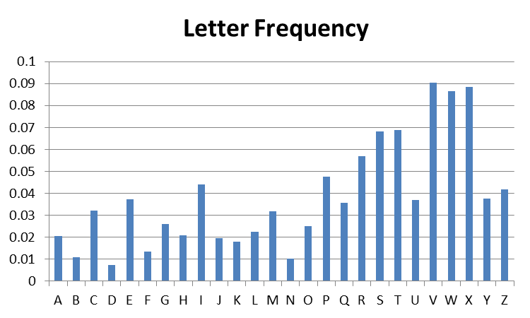

# Security properties

In this exercise, let us assume that a hacker has found several vulnerabilities on the SecLab CTF server. By exploiting those vulnerabilities, that hacker is able to realize several attacks.  

1. For each attack below, discuss the security property/ies as either "confidentiality", "integrity", "availability" that is/are at risk .

    - read the solutions submitted by other users
    - modify its own solution after the deadline
    - read the handout of a challenge before its release data
    - submit a solution to a challenge on behalf of another user
    - delete someone's else solution
    - prevent users from submitting solutions 
    - shutdown the server
    - steal all usernames and passwords 
    - use the server to mine bitcoins
    - opens a backdoor on the server as root

2. Now, let's do it the other way around! Come up with 3 possible attacks on SecLab, one for each security property and different than the ones given above.

# Classical Cryptography

Alice wants to send a message to Bob. Each message is composed of 26 characters (no space, no punctuation). To encrypt each message, Alice is considering two ciphers:

- cipher 1: a monoalphabetic cipher that substitutes each letter of the alphabet by another one (a.k.a substitution cipher) . 
- cipher 2: a polyalphabetic cipher that combines the plaintext with a key (a.k.a Vigenere's cipher). The key length is fixed to 15 characters exactly. 

3. After calculating the entropy of both ciphers. Which one is the most resistant to a brute force attack?

4. Which one is the most resistant to a ciphertext only attack? 

5. How would you attack both of these ciphers using a plaintext attack? 

# Cryptanalysis: Frequency analysis

In this discussion, we will preview the first sophisticated approach to cryptanalysis, described by Al-Kindi, born in Basra in what is now Iraq, in 801.

The first graph below shows the letter frequencies for an article that appeared in the Toronto Star. The graph was produced by generating a frequency count of alphabetic characters using a Python program, and then displaying that data using an MS-Excel chart.

The second graph below shows the letter frequencies for a Caesar (shift) cipher encoding of that same article. Caesar certainly simplifies the cryptanalyst's job!

In class we will see that Caesar and its more sophisticated cousin, monoalphabetic cipher, are both vulnerable to frequency 
cryptanalysis. 

6. Based on your understanding of the Caesar cipher, can you guess the key that was used to produce the second graph. 

Vigenere, a polyalphabetic cipher, should be less vulnerable to this attack. Yet, the third graph below shows a graph of letter-frequency for a Vigenere-encoding of the same newspaper article whose letter frequency is displayed above.

7. Based on your understanding of the Vigenere cipher, can you guess something about the key?

8. What role does a Vigenere password play in frequency profile of the ciphertext?

9. What would the ideal histogram look like, from the point of view of making cryptanalysis as difficult as possible?
