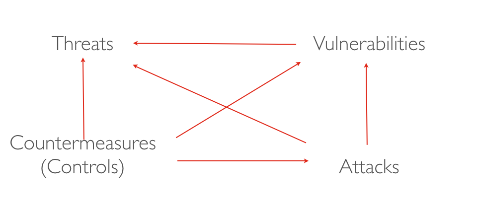

# Definitions

1. What is the difference between safety and security?

2. Complete the security theatre diagram by adding a caption verb on each arrow? 

3. What are the three main security properties:

- \_\_\_\_\_\_\_\_\_\_\_\_\_\_\_ :  Information is **disclosed** to legitimate users
- \_\_\_\_\_\_\_\_\_\_\_\_\_\_\_ :  Information is **modified** by legitimate users
- \_\_\_\_\_\_\_\_\_\_\_\_\_\_\_ :  Information is **accessible** to legitimate users

# Risk Assessment Analysis

4. Briefly explain the concept of risk exposure and explain how a risk exposure is compared to another (a.k.a triaging risk exposure)?

5. Do the risk assessment analysis for

- a UofT student
- the founder of a startup
- a public figure
- a political leader