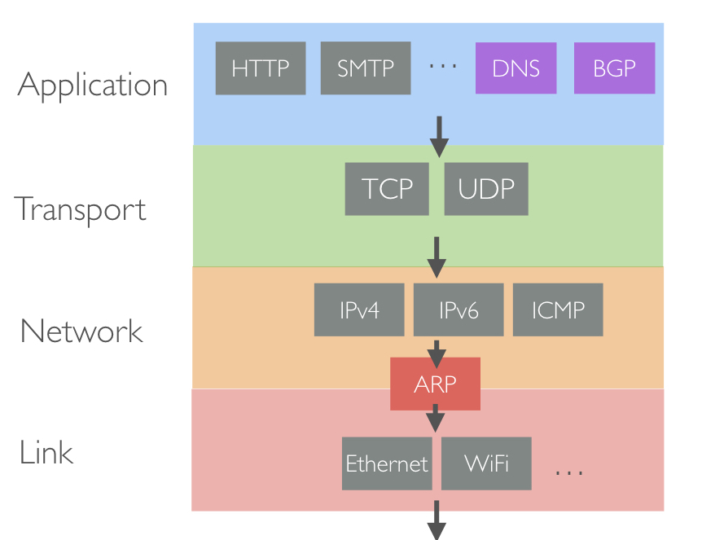
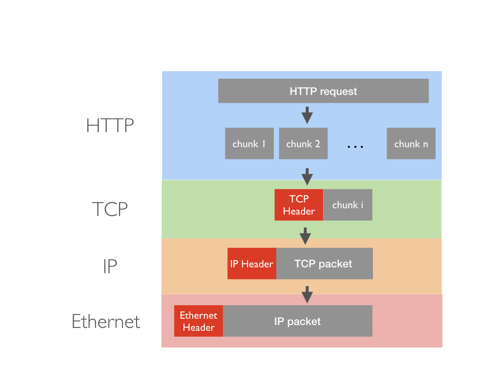
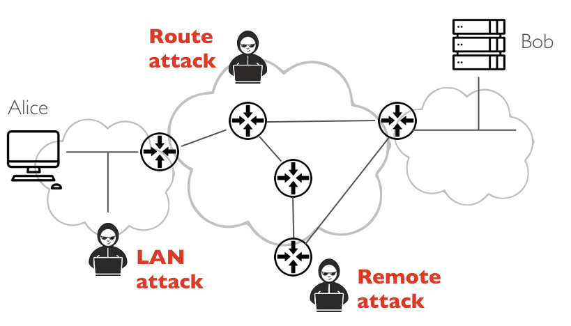

# Network Insecurity

## The protocol stack

Considering the protocol stack below: 

**Question 1:** What is the role of each layer in the network stack

- link layer
- internet layer
- transport layer
- Application layer

**Question 2:** What is the role of the special protocols:

- ARP
- BGP
- DNS

## Sending messages through the stack

Assuming that an HTTP request is sent through the network stack as shown below: 

**Question 3:** What are the most important pieces of information added in:

1. the Ethernet header 
2. the IP header
3. the TCP header

## Network attacks

**Question 4:** Considering these attacks, identify which protocol they target and briefly explain what they achieve

- Packet sniffing
- IP forgery
- ARP-cache poisoning
- Route hijacking
- DNS spoofing

## Attacking the network

Alice communicates via HTTP through the network. However, Mallory wants to either eavesdrop, hijack (MitM) or disrupt (DOS) the messages sent back and forth between the two.

As shown in the figure below, we consider three different scenarios in which Mallory controls a host located in different part of the network. These different hosts can be typed as either:

1. a **LAN** host that is on the same broadcast network (Ethernet or WiFi) as Alice
2. a **route** host (either a gateway or a router) that is on the routing path between Alice and Bob
3. a **remote** host that is somewhere on the Internet but not necessarily on a network between Alice and Bob

**Question 5:** Considering the attacks discussed earlier, explain in technical details how Mallory can either eavesdrop, hijack (MitM) or disrupt (DOS) the communication between Alice and Bob.

<pre>
    
| Host Setting           | Eavesdropping           | Hijaking                | DOS                     |
| -----------------------|:-----------------------:|:-----------------------:|:-----------------------:|
| LAN                    |                         |                         |                         |
| Route                  |                         |                         |                         |
| Remote                 |                         |                         |                         |

</pre>

## HTTPs as a counter-measure

Let us assume that Alice and Bob are exchanging messages securely via HTTPs. 

**Question 6:** Would HTTPs defeat none, some or all attacks identified earlier? In your analyze, assume that Mallory cannot generate a valid certificate for Bob. 